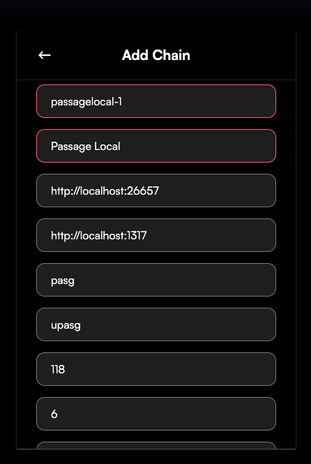

# Passage Staking Site

This is a Next.js project for managing the Passage NFT Vault.

## Getting Started

1. Install dependencies: `bun i`
2. Generate the chain types: `bun run gen:graz`
3. Run the chain and the site locally: `bun run dev:start`

## Wallet Setup

To develop locally you will have to connect a Leap wallet to the locally running chain. Simply open up the Leap app, click the chain dropdown, and then the `+` sign. Then fill out the fields according to the screenshot below.

Additionally navigate to the `setup/configs/localnet.ts` to find mnemonics for the accounts that are pre-funded with testnet tokens.
